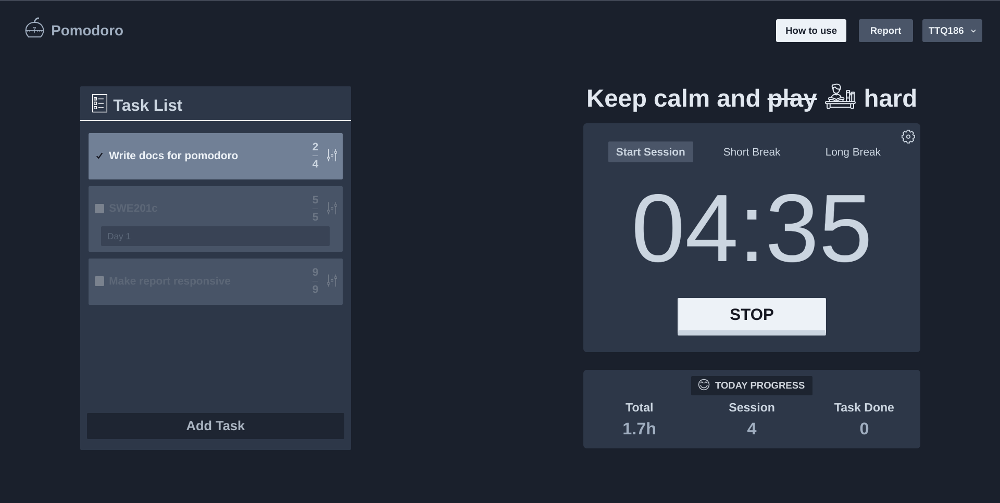

#  Pomodoro

### **A Pomodoro app, built with FastAPI/SQLAlchemy and React/Redux**

### Click here for [live demo](https://pomodoro.ttq186.dev)

## Description
- Pomodoro is a famous time management technique that helps us boost our productivity. It uses a timer to break work into sessions (typically 25mins) separated by short breaks (typically 5mins). After 4 consecutive sessions, we will take a long break (typically 20mins) and start over until our target task is finished.
- In the past, I applied this technique a lot at [Pomofocus.io](https://pomofocus.io) and it's helped to boost my productivity a lot. This is a great Pomodoro app with beautiful UI and many handy features. One day, I decided to create a Pomorodo app of my own. It is the reason why this project was created.

## Features
- Authenticate with OAuth2 + JWT token
- Sign in/sign out/change password
- Reset password via email with an intuitive email template
- Test API directly with an interactive API document (SwaggerUI)
- Apply the pomodoro technique for the countdown timer 
- Add todo tasks with the target number and finish them later
- Change timer settings
- Report finished tasks, ranking between users in current week
- Report activity overview, focus hours in week, year with an intuitive bar chart 

## Tech stack
- **Front-end**
    - **ReactJS**
    - **Redux**
    - **Chakra UI** 
- **Back-end**
    - **FastAPI**
    - **SQLAlchemy**
    - **Pydantic**  
- **Database**
    - **Postgresql**

## Credits
- This project is inspired by [Pomofocus.io](https://pomofocus.io)
